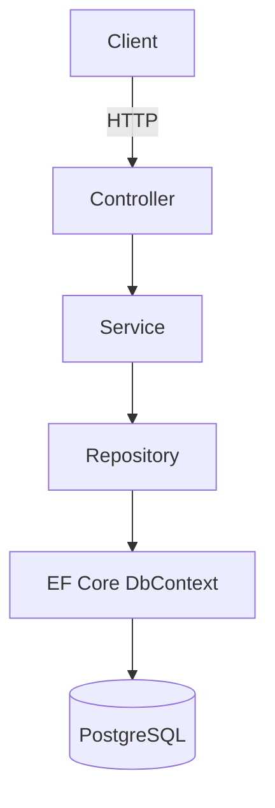
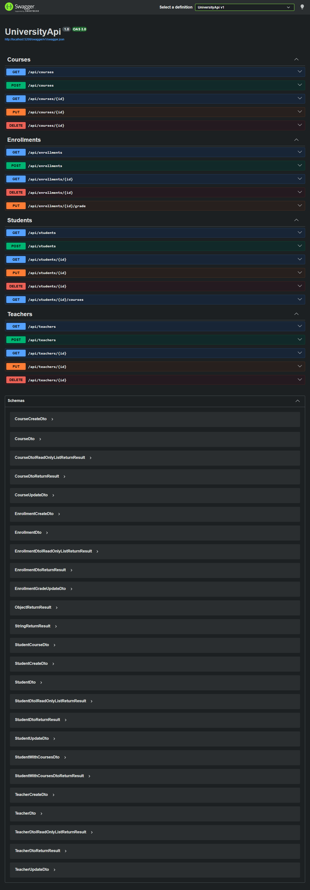
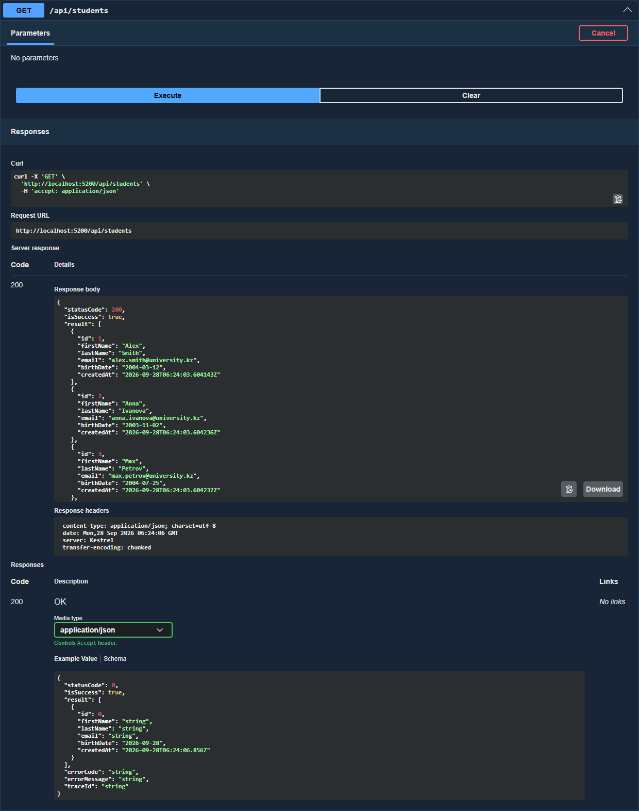
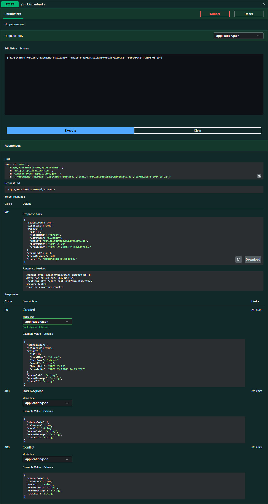
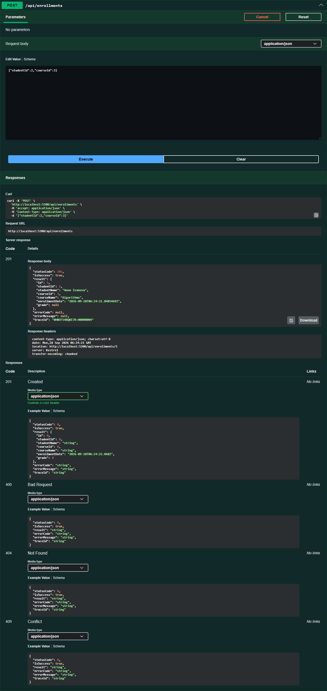
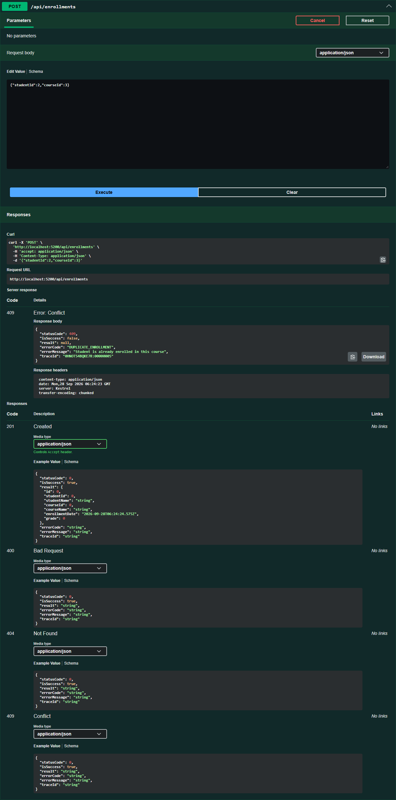
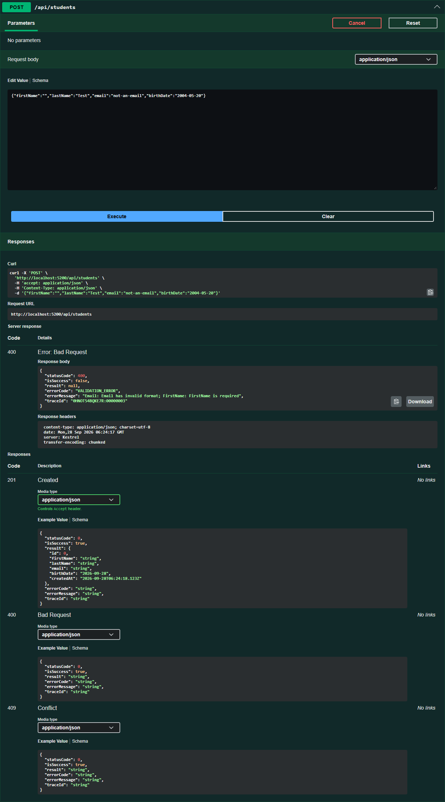
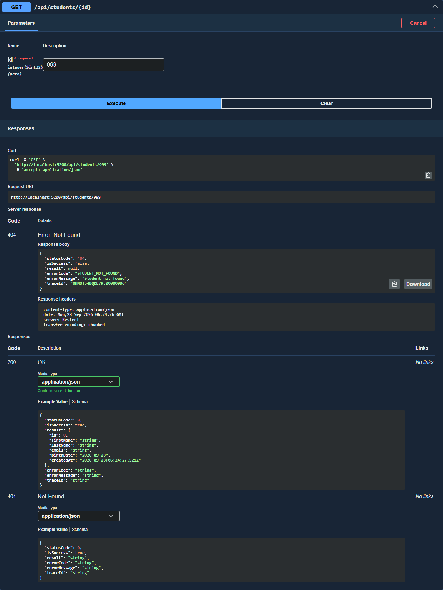

# Задание 1, модули 1-4. University Course Management API

REST API для управления университетскими курсами: студенты, преподаватели, курсы и записи студентов на курсы. Данные хранятся в PostgreSQL, доступ через Entity Framework Core.

Стек: .NET 10, ASP.NET Core Web API, EF Core 10 с провайдером Npgsql, PostgreSQL 17 в Docker, AutoMapper, Swagger.

## Запуск

Поднять базу:

```bash
docker compose up -d
```

Запустить API из папки Assignment01:

```bash
dotnet run --project UniversityApi --launch-profile https
```

Swagger открывается сам на https://localhost:7200/swagger, HTTP-порт 5200.

При старте приложение само применяет миграции и, если база пустая, заполняет её тестовыми данными: 3 преподавателя, 4 студента, 4 курса, 4 записи на курсы.

Готовый дамп базы с тестовыми данными лежит в `db/dump.sql`, восстановить можно так:

```bash
docker exec -i university-db psql -U postgres -d university < db/dump.sql
```

## Архитектура

```
Client (Swagger, Postman, веб или мобильное приложение)
  |  HTTP
Controller       принимает запрос, отдаёт ReturnResult, больше ничего не делает
  |
Service          бизнес-правила, проверки, логирование, маппинг DTO
  |
Repository       запросы к данным, никакой бизнес-логики
  |
Entity Framework Core
  |
PostgreSQL
```



Структура проекта:

```
UniversityApi
├── Controllers      StudentsController, TeachersController, CoursesController, EnrollmentsController
├── Models           Student, Teacher, Course, Enrollment
├── Dtos             отдельные DTO на чтение, создание и обновление
├── Data             ApplicationDbContext, DbSeeder
├── Repositories     Interfaces и Implementations
├── Services         Interfaces и Implementations, бизнес-правила
├── Mapping          MappingProfile для AutoMapper
├── Middleware       ExceptionHandlingMiddleware
├── Common           ReturnResult, ApiException, ErrorCodes
├── Migrations       миграции EF Core
└── Program.cs       регистрация зависимостей и конвейер
```

## Endpoints

Students:

| Метод | URL | Назначение | Коды |
|---|---|---|---|
| GET | `/api/students` | все студенты | 200 |
| GET | `/api/students/{id}` | студент по id | 200, 404 |
| GET | `/api/students/{id}/courses` | студент вместе с его курсами и оценками | 200, 404 |
| POST | `/api/students` | создать студента | 201, 400, 409 |
| PUT | `/api/students/{id}` | изменить студента | 200, 400, 404, 409 |
| DELETE | `/api/students/{id}` | удалить студента | 200, 404 |

Teachers:

| Метод | URL | Назначение | Коды |
|---|---|---|---|
| GET | `/api/teachers` | все преподаватели | 200 |
| GET | `/api/teachers/{id}` | преподаватель по id | 200, 404 |
| POST | `/api/teachers` | создать преподавателя | 201, 400, 409 |
| PUT | `/api/teachers/{id}` | изменить преподавателя | 200, 400, 404, 409 |
| DELETE | `/api/teachers/{id}` | удалить преподавателя | 200, 404 |

Courses:

| Метод | URL | Назначение | Коды |
|---|---|---|---|
| GET | `/api/courses` | все курсы, есть фильтры `teacherId`, `minCredits`, `search` | 200 |
| GET | `/api/courses/{id}` | курс по id | 200, 404 |
| POST | `/api/courses` | создать курс и привязать преподавателя | 201, 400, 404 |
| PUT | `/api/courses/{id}` | изменить курс | 200, 400, 404 |
| DELETE | `/api/courses/{id}` | удалить курс | 200, 404 |

Enrollments:

| Метод | URL | Назначение | Коды |
|---|---|---|---|
| GET | `/api/enrollments` | все записи | 200 |
| GET | `/api/enrollments/{id}` | запись по id | 200, 404 |
| POST | `/api/enrollments` | записать студента на курс | 201, 400, 404, 409 |
| PUT | `/api/enrollments/{id}/grade` | изменить оценку | 200, 400, 404 |
| DELETE | `/api/enrollments/{id}` | снять студента с курса | 200, 404 |

Пример фильтрации: `/api/courses?minCredits=5`, `/api/courses?search=web`, `/api/courses?teacherId=1`.

## Единый формат ответа

Любой endpoint возвращает `ReturnResult<T>`.

Успех:

```json
{
  "statusCode": 201,
  "isSuccess": true,
  "result": { "id": 5, "firstName": "Nurlan", "lastName": "Sultanov" },
  "errorCode": null,
  "errorMessage": null,
  "traceId": "0HNOT51ETVM7D:00000001"
}
```

Ошибка:

```json
{
  "statusCode": 404,
  "isSuccess": false,
  "result": null,
  "errorCode": "STUDENT_NOT_FOUND",
  "errorMessage": "Student not found",
  "traceId": "0HNOT51ETVM7I:00000001"
}
```

Коды ошибок:

| errorCode | HTTP | Когда возникает |
|---|---|---|
| VALIDATION_ERROR | 400 | DTO не прошёл валидацию |
| STUDENT_NOT_FOUND | 404 | студента с таким id нет |
| TEACHER_NOT_FOUND | 404 | преподавателя с таким id нет |
| COURSE_NOT_FOUND | 404 | курса с таким id нет |
| ENROLLMENT_NOT_FOUND | 404 | записи с таким id нет |
| EMAIL_ALREADY_EXISTS | 409 | email уже занят |
| DUPLICATE_ENROLLMENT | 409 | студент уже записан на этот курс |
| INTERNAL_SERVER_ERROR | 500 | непредвиденная ошибка |

## Бизнес-правила

1. Нельзя записать студента на несуществующий курс, возвращается 404 COURSE_NOT_FOUND.
2. Нельзя записать несуществующего студента, возвращается 404 STUDENT_NOT_FOUND.
3. Один студент не может быть дважды записан на один курс. Проверка в сервисе плюс уникальный индекс по паре StudentId и CourseId в базе, ответ 409 DUPLICATE_ENROLLMENT.
4. Курс не может ссылаться на несуществующего преподавателя, при создании и изменении курса возвращается 404 TEACHER_NOT_FOUND.
5. Запрос несуществующего объекта никогда не возвращается как успех, всегда 404 с описанием.

Дополнительно email студента и преподавателя уникален, повтор даёт 409.

## Конфигурация моделей EF Core

Использованы три способа сразу:

- Conventions: свойство `Id` становится первичным ключом, свойства `StudentId` и `CourseId` распознаются как внешние ключи.
- Data Annotations: в `Student` и `Teacher` стоят `[Required]`, `[MaxLength]` и `[EmailAddress]`.
- Fluent API: в `ApplicationDbContext` настроены курс и запись на курс. Заданы длины строк, обязательные поля, связи, поведение при удалении и уникальные индексы.

Связи: у преподавателя много курсов (удаление преподавателя с курсами запрещено, Restrict), у студента и у курса много записей (записи удаляются каскадом).

## Dependency Injection и время жизни

Всё регистрируется в `Program.cs`, контроллеры получают зависимости через конструктор, `new` для репозиториев нигде нет.

Репозитории и сервисы зарегистрированы как Scoped, то есть один экземпляр на HTTP-запрос. Это совпадает со временем жизни `DbContext`, который тоже Scoped: в рамках одного запроса все работают с одним контекстом и видят одни и те же отслеживаемые сущности. Singleton не подходит, потому что `DbContext` не потокобезопасен и один экземпляр на всё приложение ломался бы при параллельных запросах. Transient создавал бы несколько разных контекстов внутри одного запроса, и изменения из одного репозитория не были бы видны другому.

## Валидация

Проверяются DTO через атрибуты: имя и фамилия обязательны и не длиннее 50 символов, email обязателен и должен быть корректным, название курса обязательно, кредиты от 1 до 10, оценка от 0 до 100, идентификаторы положительные.

Стандартный ответ ASP.NET Core заменён своим: `InvalidModelStateResponseFactory` в `Program.cs` возвращает тот же `ReturnResult` с кодом 400 и errorCode VALIDATION_ERROR, чтобы формат ответа не отличался от остальных.

## Логирование

Используется `ILogger` в сервисах и middleware:

- Information: создание, изменение и удаление объектов, запись студента на курс, заполнение базы тестовыми данными.
- Warning: попытка получить несуществующий объект, повторная запись на курс, занятый email.
- Error: непредвиденные исключения, пишутся вместе со стеком в `ExceptionHandlingMiddleware`.

## Обработка исключений

`ExceptionHandlingMiddleware` стоит первым в конвейере. Свои ошибки бизнес-логики (`ApiException`) превращаются в ответ с нужным HTTP-кодом и errorCode. Любое другое исключение логируется с деталями и превращается в ответ 500 с errorCode INTERNAL_SERVER_ERROR. Клиент не видит ни стека, ни SQL, ни внутренних деталей.

## Скриншоты Swagger

Список endpoints:



Получение списка студентов:



Создание студента, 201:



Запись студента на курс, 201:



Повторная запись на тот же курс, 409:



Ошибка валидации, 400:



Несуществующий студент, 404:



## Проверенные сценарии

Все пункты из задания прогнаны через HTTP-запросы к API:

| Сценарий | Результат |
|---|---|
| Список студентов | 200 |
| Создание студента | 201 |
| Получение созданного студента по id | 200 |
| Изменение студента | 200 |
| Создание преподавателя | 201 |
| Создание курса с привязкой преподавателя | 201 |
| Запись студента на курс | 201 |
| Повторная запись на тот же курс | 409 DUPLICATE_ENROLLMENT |
| Студент вместе с курсами | 200 |
| Фильтрация курсов по кредитам и названию | 200 |
| Удаление записи с курса | 200 |
| Получение несуществующего студента | 404 STUDENT_NOT_FOUND |
| Пустое имя и кривой email | 400 VALIDATION_ERROR |
| Курс с несуществующим преподавателем | 404 TEACHER_NOT_FOUND |
| Запись несуществующего студента | 404 STUDENT_NOT_FOUND |
| Записи событий в логах | Information, Warning, Error |
