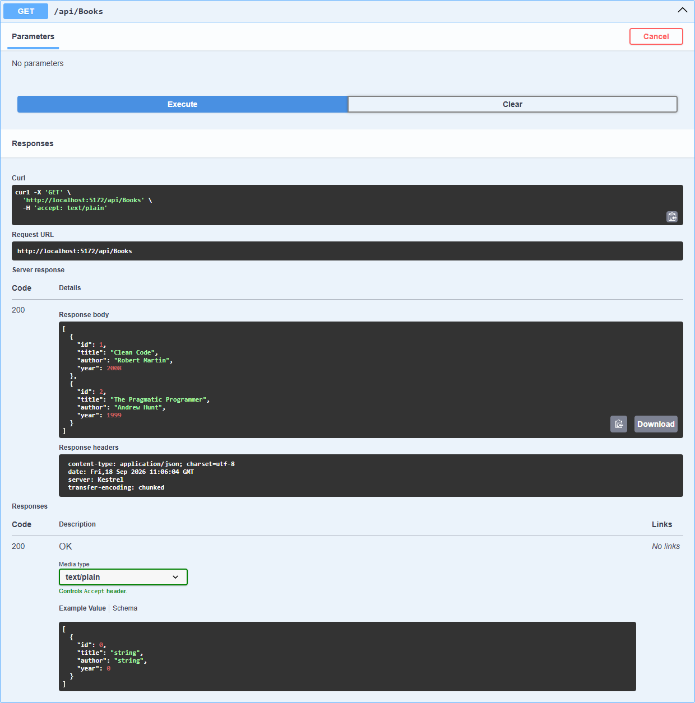
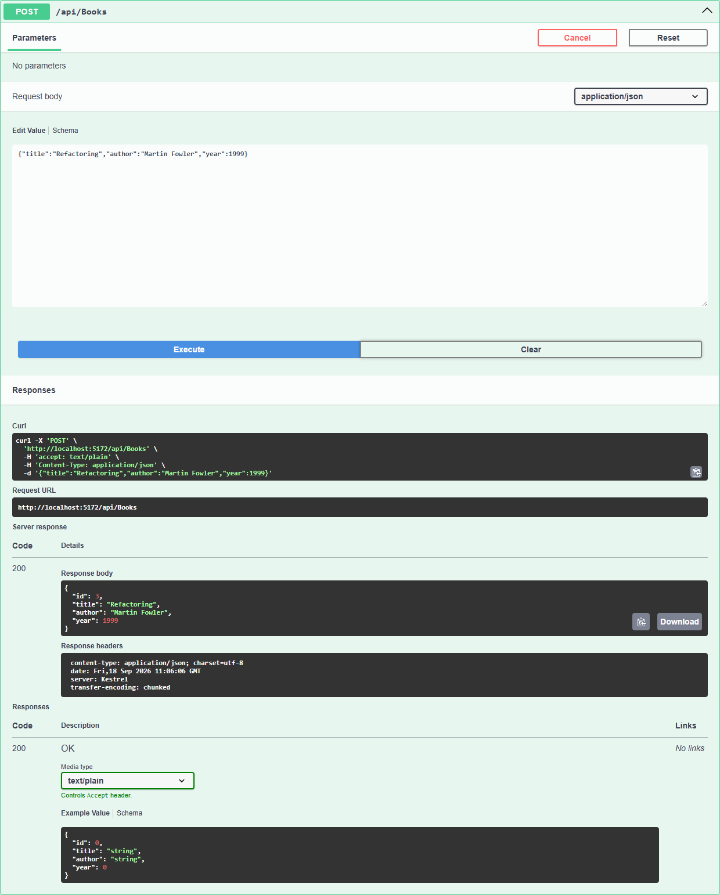

# Домашнее задание 2. BooksApi

Web API для управления списком книг. Весь код в одном файле `Program.cs`: модель `Book` с полями Id, Title, Author и Year, контроллер `BooksController` и запуск. Данные лежат в `List<Book>`, база не подключается.

| HTTP | Маршрут | Назначение |
|---|---|---|
| GET | `/api/books` | получить список книг |
| POST | `/api/books` | добавить книгу |

Запуск из корня репозитория:

```bash
dotnet run --project Module02/Homework --launch-profile https
```

## Скриншоты Swagger

GET /api/books:



POST /api/books, после него книга появляется в списке:


