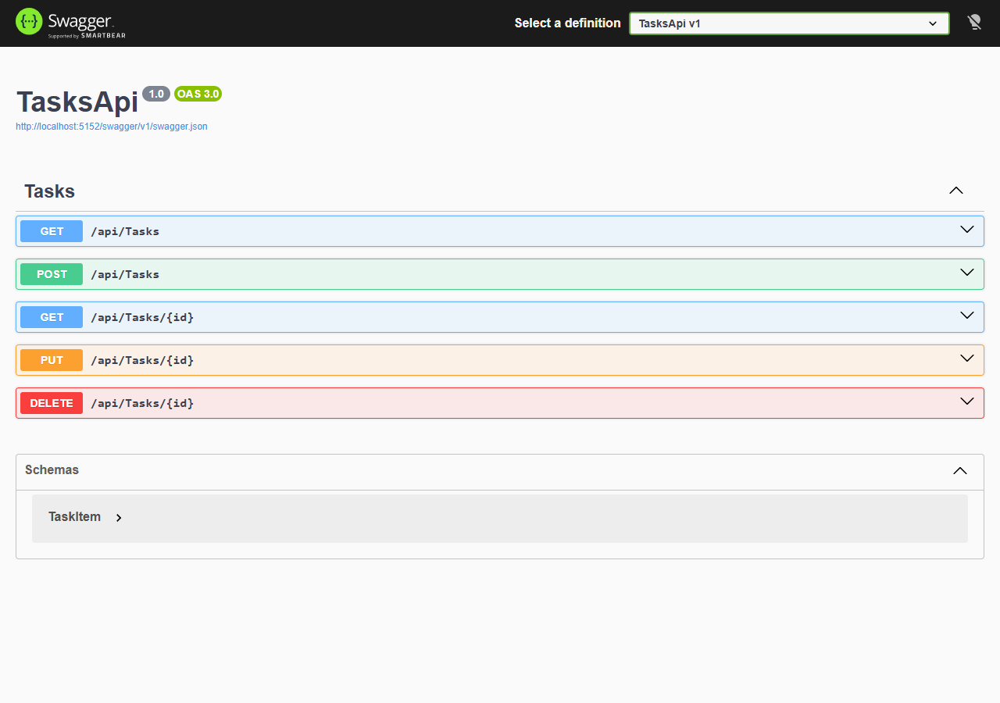
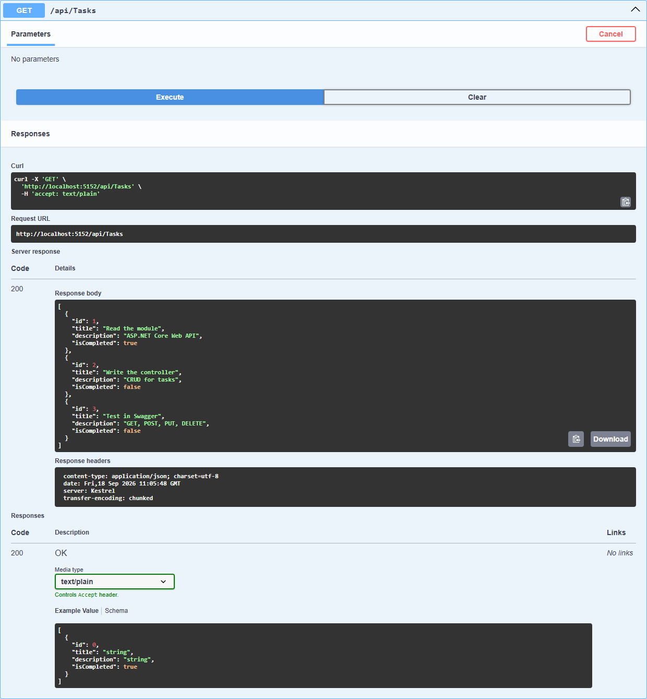
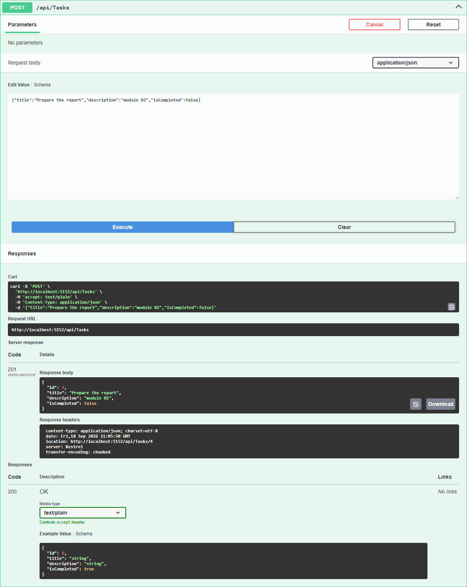
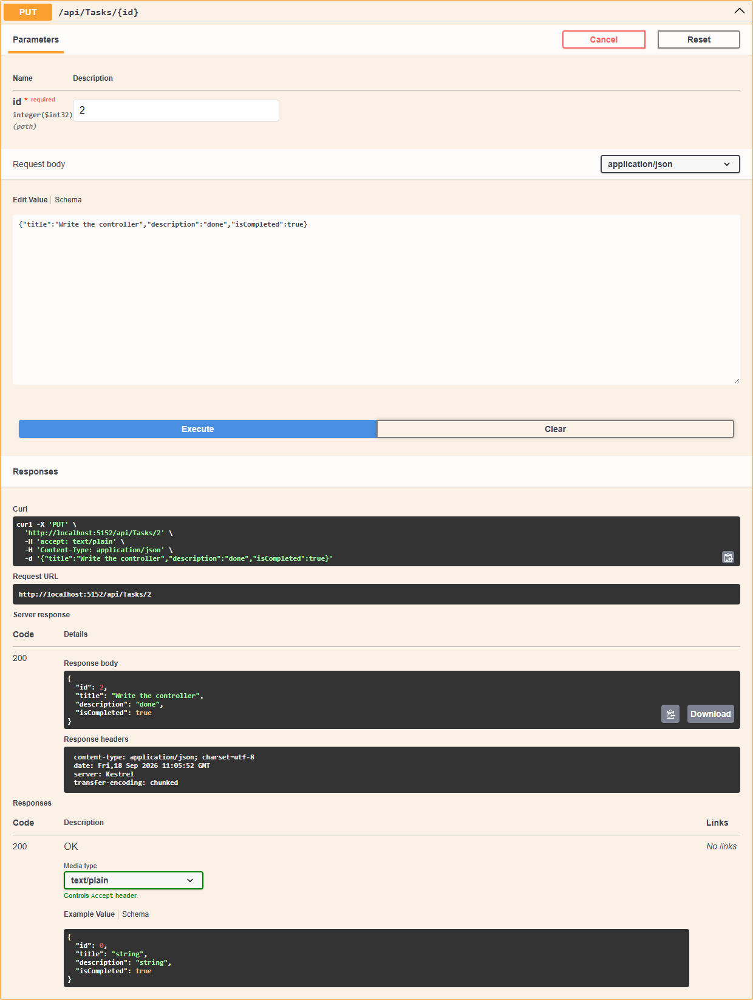
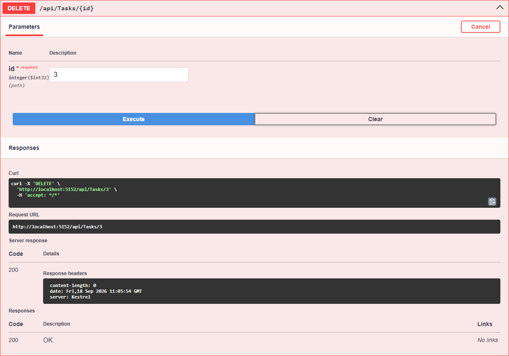

# Лабораторная работа 2. TasksApi

REST API для управления списком задач. Весь код в одном файле `Program.cs`: модель `TaskItem`, контроллер `TasksController` и запуск. Данные хранятся в `List<TaskItem>`, база не используется.

| HTTP | Маршрут | Назначение | Коды |
|---|---|---|---|
| GET | `/api/tasks` | получить все задачи | 200 |
| GET | `/api/tasks/{id}` | получить задачу по id | 200, 404 |
| POST | `/api/tasks` | добавить задачу | 201, 400 |
| PUT | `/api/tasks/{id}` | изменить задачу | 200, 400, 404 |
| DELETE | `/api/tasks/{id}` | удалить задачу | 200, 404 |

400 возвращается, если в запросе пустой Title.

Запуск из корня репозитория:

```bash
dotnet run --project Module02/Lab --launch-profile https
```

## Скриншоты Swagger

Список реализованных методов:



GET:



POST:



PUT:



DELETE:



## Контрольные вопросы

### 1. Что такое Web API?
Интерфейс, через который программы обмениваются данными по HTTP. Клиент шлёт запрос на адрес, сервер отвечает данными в JSON.

### 2. Для чего используется атрибут [ApiController]?
Он помечает класс как API-контроллер. Модель из тела запроса подставляется автоматически, а при ошибках валидации сразу возвращается 400, вручную это проверять не надо.

### 3. Для чего используется [Route]?
Задаёт адрес контроллера. `[Route("api/[controller]")]` у `TasksController` даёт `api/tasks`.

### 4. Чем отличаются методы GET и POST?
GET забирает данные и ничего не меняет, его можно повторять сколько угодно. POST создаёт новую запись, данные идут в теле запроса, и каждый повтор создаёт ещё одну запись.

### 5. Чем отличаются PUT и DELETE?
PUT заменяет существующий объект по id, DELETE его удаляет. После DELETE объекта больше нет, повторный запрос вернёт 404.

### 6. Что означают HTTP-коды 200, 201, 400 и 404?
200 - запрос выполнен успешно. 201 - создан новый объект. 400 - в запросе некорректные данные, например пустое название. 404 - объект с таким id не найден.
