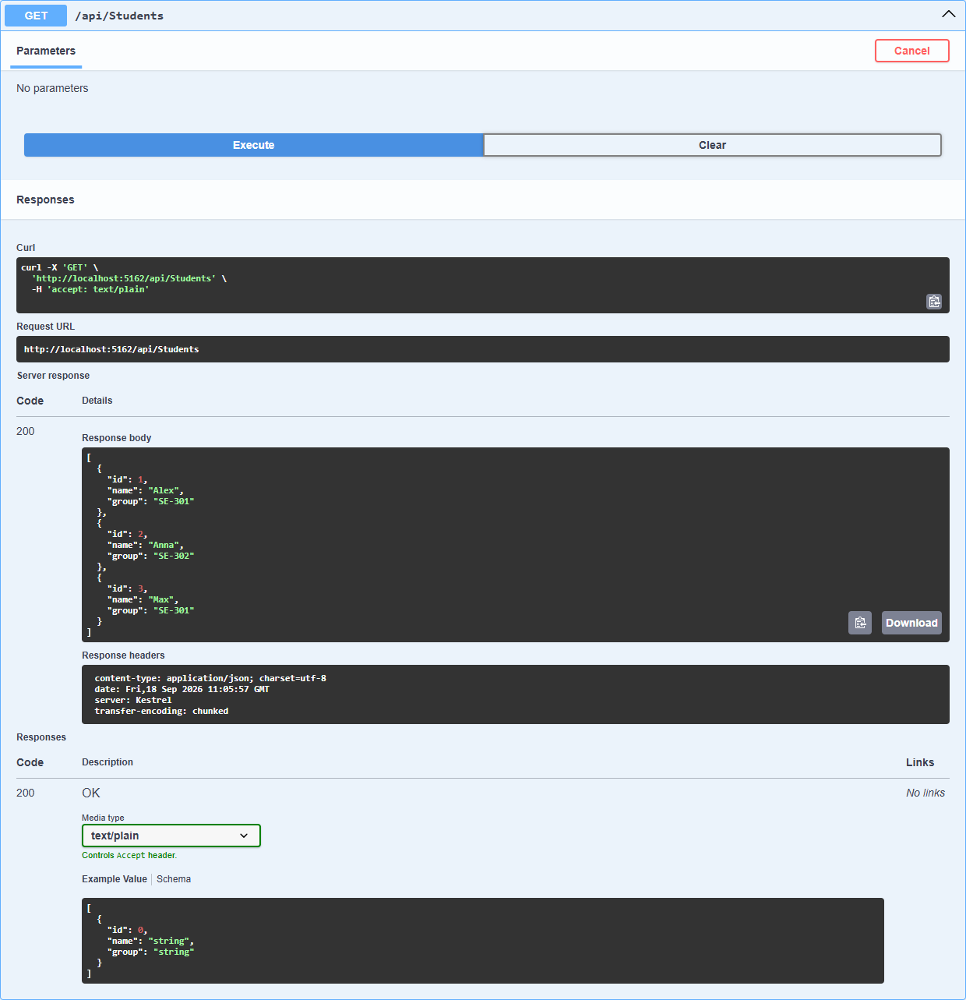
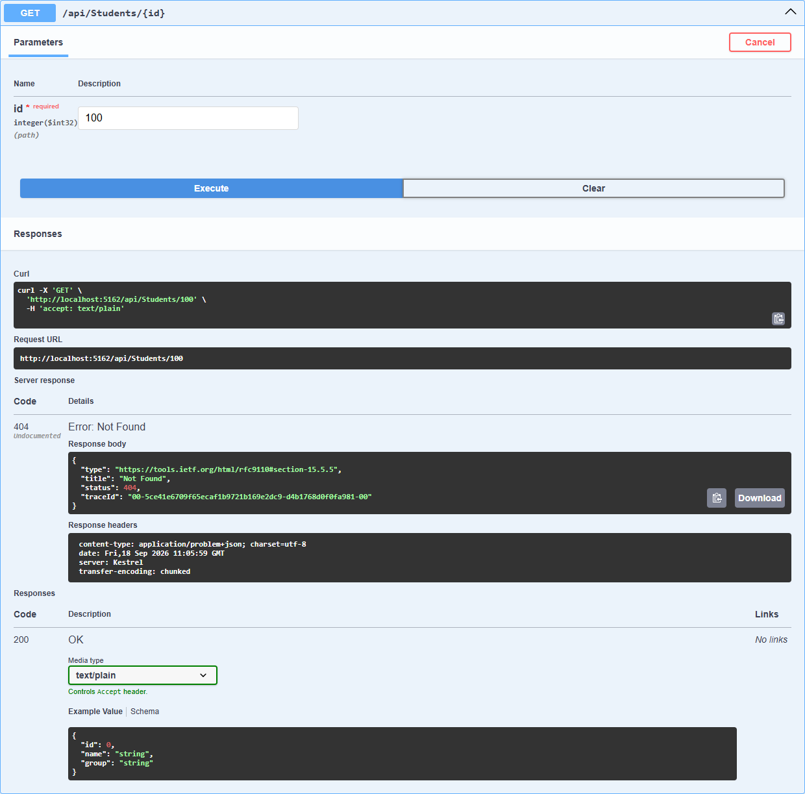
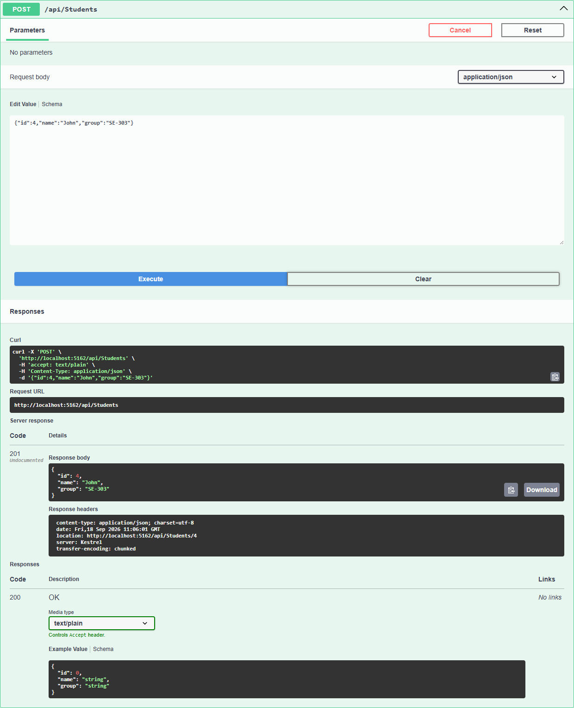

# Практическая работа 2. StudentsApi

Web API для хранения информации о студентах. Весь код в одном файле `Program.cs`: модель `Student`, контроллер `StudentsController` и запуск.

| HTTP | Маршрут | Назначение | Коды |
|---|---|---|---|
| GET | `/api/students` | получить всех студентов | 200 |
| GET | `/api/students/{id}` | получить студента по id | 200, 404 |
| POST | `/api/students` | добавить студента | 201 |

В списке заранее лежат три студента: Alex (SE-301), Anna (SE-302) и Max (SE-301).

Запуск из корня репозитория:

```bash
dotnet run --project Module02/Practice --launch-profile https
```

## Что показать преподавателю

Запущенный проект, Swagger UI, работающие GET, GET по id и POST, а также ответ 404 на несуществующий id.

## Скриншоты Swagger

GET /api/students:



GET /api/students/100, такого студента нет:



POST /api/students:



## Контрольные вопросы

### 1. Что такое Web API?
Сервис, к которому обращаются по HTTP и получают данные в JSON, без всякого интерфейса для человека.

### 2. Для чего нужен ControllerBase?
Это базовый класс для API-контроллеров. Из него берутся `Ok()`, `NotFound()`, `BadRequest()`, `CreatedAtAction()` и доступ к запросу. Поддержки View в нём нет, для API она не нужна.

### 3. Что делает атрибут [ApiController]?
Включает поведение для API: автоматическую привязку модели из JSON и ответ 400 при неверных данных.

### 4. Для чего используется [Route]?
Указывает, по какому адресу доступен контроллер, например `api/students`.

### 5. В чем разница между GET и POST?
GET возвращает данные, POST отправляет новые данные на сервер и добавляет запись.

### 6. Что означает HTTP-код 404 Not Found?
Запрошенного объекта нет, например студента с таким id не существует.
